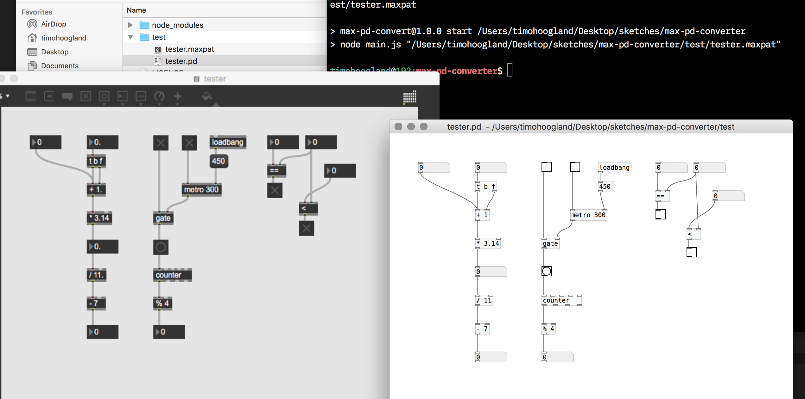

# max-pd-converter

A Node.JS script that converts MaxMSP patches to PureData patches. At the moment it does not check for compatible objects or alternatively named objects. This may result in Pd-patches that are not immediately working because of syntax errors in the patches. This converter however can work as a quick starting point for converting your patches without having to repatch everything. 

**This is a work-in-progress and contributions are welcome!**

# Install

```
$ git clone https://github.com/tmhglnd/max-pd-converter
$ cd max-pd-converter
$ npm install
```

# Usage

```
$ npm start <filepath>/<filename>.maxpat
```

The result is stored in the same folder as the original file and named as `<filename>.pd`



## Contribution

1. Fork this repository (click `fork` in the top right)
2. Clone the repository to your computer `git clone https://github.com/<this-is-you>/<forked-repo>.git`
3. Branch the Fork `git checkout -b <name-your-branch>`
4. Make the changes to the code
5. Add, commit and push your changes `git add .` `git commit -a` `git push origin <your-branch-name>`
6. Go to your forked repo in the browser and click `compare & pull request`, then `create pull request`

# License

The MIT License

Copyright (c) 2020 Timo Hoogland

Permission is hereby granted, free of charge, to any person obtaining a copy of this software and associated documentation files (the "Software"), to deal in the Software without restriction, including without limitation the rights to use, copy, modify, merge, publish, distribute, sublicense, and/or sell copies of the Software, and to permit persons to whom the Software is furnished to do so, subject to the following conditions:

The above copyright notice and this permission notice shall be included in all copies or substantial portions of the Software.

THE SOFTWARE IS PROVIDED "AS IS", WITHOUT WARRANTY OF ANY KIND, EXPRESS OR IMPLIED, INCLUDING BUT NOT LIMITED TO THE WARRANTIES OF MERCHANTABILITY, FITNESS FOR A PARTICULAR PURPOSE AND NONINFRINGEMENT. IN NO EVENT SHALL THE AUTHORS OR COPYRIGHT HOLDERS BE LIABLE FOR ANY CLAIM, DAMAGES OR OTHER LIABILITY, WHETHER IN AN ACTION OF CONTRACT, TORT OR OTHERWISE, ARISING FROM, OUT OF OR IN CONNECTION WITH THE SOFTWARE OR THE USE OR OTHER DEALINGS IN THE SOFTWARE.
